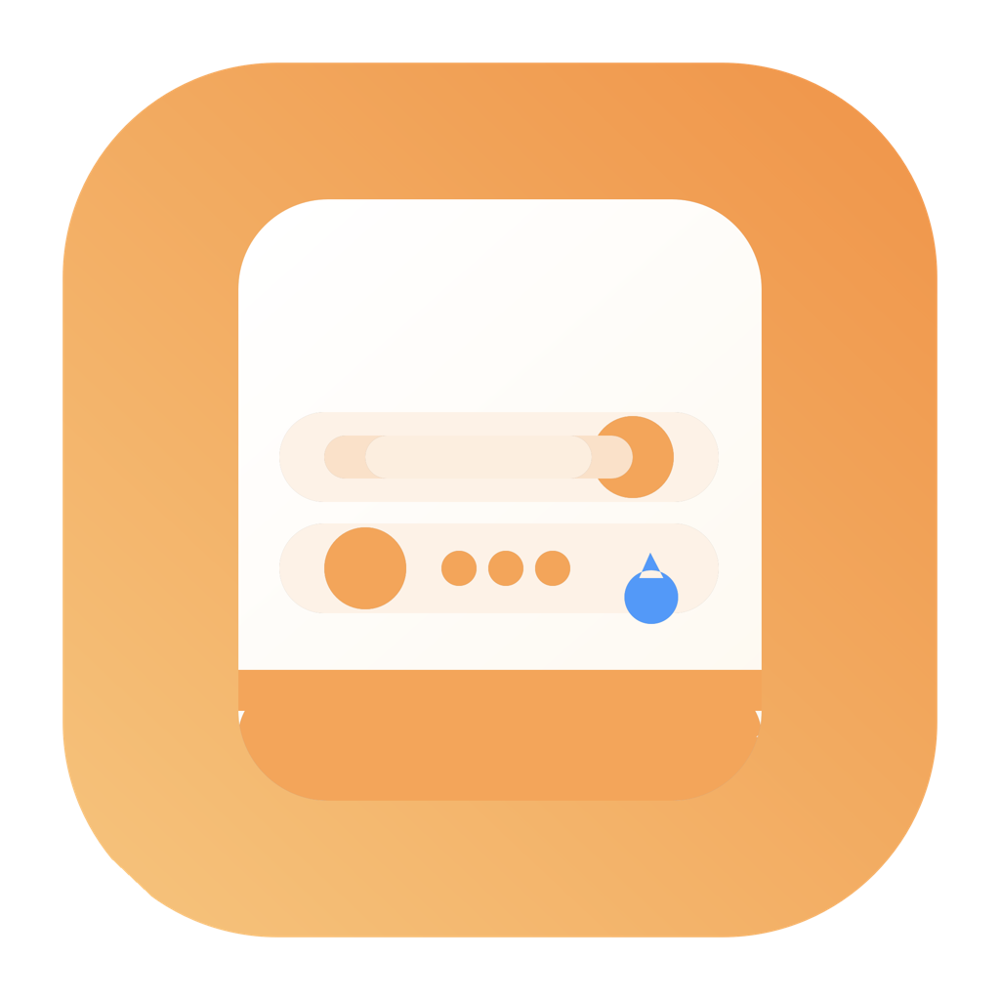

# NovaDateRangeKit


A fully programmatic UIKit date-range picker component for iOS.

## Features
- Month/year header with previous and next navigation
- Weekday row (`M T W T F S S`)
- Start and end date selection with orange circular markers
- In-range row pill rendering with rounded start/end caps
- Today indicator with a blue teardrop badge
- Min-date restriction for disabling past dates
- Diffable data source on iOS 13+ with iOS 12 fallback data source

## Requirements
- iOS 12+
- Swift 5.9+
- UIKit

## Installation (Swift Package Manager)
In Xcode:
1. Open your app project.
2. Go to **Package Dependencies**.
3. Add this package repository URL.
4. Add product `NovaDateRangeKit` to your app target.

## Installation (CocoaPods)
Add this to your `Podfile`:

```ruby
pod 'NovaDateRangeKit', '~> 1.0'
```

Then run:

```bash
pod install
```

## Usage
```swift
import UIKit
import NovaDateRangeKit

final class ViewController: UIViewController, CalendarPickerDelegate {
    private let calendarView = CalendarView()

    override func viewDidLoad() {
        super.viewDidLoad()
        view.backgroundColor = .white

        calendarView.delegate = self
        calendarView.minDate = Calendar.current.startOfDay(for: Date())

        view.addSubview(calendarView)
        calendarView.translatesAutoresizingMaskIntoConstraints = false

        NSLayoutConstraint.activate([
            calendarView.leadingAnchor.constraint(equalTo: view.leadingAnchor, constant: 12),
            calendarView.trailingAnchor.constraint(equalTo: view.trailingAnchor, constant: -12),
            calendarView.topAnchor.constraint(equalTo: view.safeAreaLayoutGuide.topAnchor, constant: 20),
            calendarView.heightAnchor.constraint(equalTo: calendarView.widthAnchor, multiplier: 1.08)
        ])
    }

    func calendarPicker(_ picker: CalendarView, didSelectRange range: DateRange) {
        print("Range: \(range.startDate) - \(range.endDate)")
    }

    func calendarPicker(_ picker: CalendarView, didSelectStartDate date: Date) {
        print("Start date: \(date)")
    }
}
```

A sample `ViewController.swift` is available in `Examples/SampleUsage/`.
