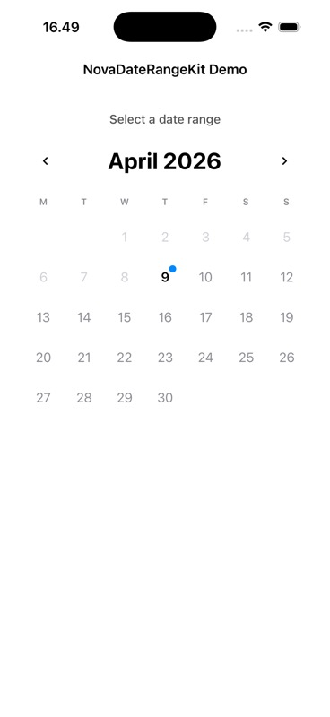
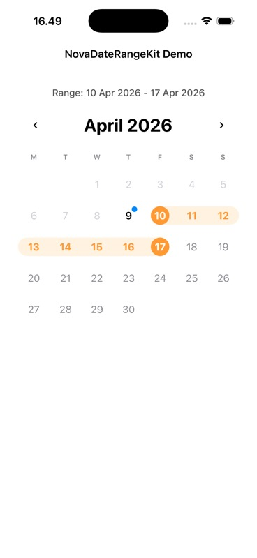

# NovaDateRangeKit


`NovaDateRangeKit` is a fully programmatic UIKit calendar date-range picker with start/end selection, connected in-range highlighting, month navigation, and customizable typography.

## Preview

| Default | Range Selected |
| --- | --- |
|  |  |

## Features

- UIKit-only implementation (no storyboard / xib)
- Date range selection with auto-correct when `endDate < startDate`
- Connected in-range background rendering across cells and rows
- Month navigation with button and swipe gestures
- `minDate` support for disabling past dates
- Delegate callbacks for start date, range selection, and reset
- iOS 13+ diffable data source with iOS 12 fallback
- Custom font API for month title, weekday labels, and day states

## Requirements

- iOS 12.0+
- Swift 5.9+
- Xcode 15+

## Installation

### Swift Package Manager

1. In Xcode, open your app project.
2. Go to `File` > `Add Package Dependencies...`
3. Use your repository URL.
4. Add product `NovaDateRangeKit` to your target.

### CocoaPods

Add to your `Podfile`:

```ruby
pod 'NovaDateRangeKit', '~> 1.0'
```

Then run:

```bash
pod install
```

## Quick Start

```swift
import UIKit
import NovaDateRangeKit

final class ViewController: UIViewController, CalendarPickerDelegate {
    private let calendarView = NovaCalendarView()

    override func viewDidLoad() {
        super.viewDidLoad()
        view.backgroundColor = .white

        calendarView.delegate = self
        calendarView.minDate = Calendar.current.startOfDay(for: Date())

        view.addSubview(calendarView)
        calendarView.translatesAutoresizingMaskIntoConstraints = false

        NSLayoutConstraint.activate([
            calendarView.leadingAnchor.constraint(equalTo: view.leadingAnchor, constant: 12),
            calendarView.trailingAnchor.constraint(equalTo: view.trailingAnchor, constant: -12),
            calendarView.topAnchor.constraint(equalTo: view.safeAreaLayoutGuide.topAnchor, constant: 20),
            calendarView.heightAnchor.constraint(equalTo: calendarView.widthAnchor, multiplier: 1.08)
        ])
    }

    func calendarPicker(_ picker: NovaCalendarView, didSelectRange range: DateRange) {
        print("Range: \(range.startDate) - \(range.endDate)")
    }

    func calendarPicker(_ picker: NovaCalendarView, didSelectStartDate date: Date) {
        print("Start date: \(date)")
    }

    func calendarPickerDidResetSelection(_ picker: NovaCalendarView) {
        print("Selection reset")
    }
}
```

## Font Customization

You can customize fonts globally using either a configuration object or partial overrides.

### Full Configuration

```swift
import NovaDateRangeKit

let fonts = NovaCalendarFontConfiguration(
    monthTitleFont: .boldSystemFont(ofSize: 22),
    weekdayFont: .systemFont(ofSize: 12, weight: .medium),
    dayFont: .systemFont(ofSize: 16, weight: .regular),
    selectedDayFont: .systemFont(ofSize: 16, weight: .bold),
    inRangeDayFont: .systemFont(ofSize: 16, weight: .semibold),
    todayDayFont: .systemFont(ofSize: 16, weight: .semibold),
    disabledDayFont: .systemFont(ofSize: 16, weight: .regular)
)

calendarView.setFonts(fonts)
```

### Partial Override

```swift
calendarView.setFonts(
    monthTitleFont: .systemFont(ofSize: 24, weight: .bold),
    weekdayFont: .systemFont(ofSize: 11, weight: .semibold)
)
```

## Public API

### `NovaCalendarView`

- `delegate: CalendarPickerDelegate?`
- `minDate: Date?`
- `fontConfiguration: NovaCalendarFontConfiguration`
- `setFonts(_ configuration: NovaCalendarFontConfiguration)`
- `setFonts(monthTitleFont:weekdayFont:dayFont:selectedDayFont:inRangeDayFont:todayDayFont:disabledDayFont:)`

### `CalendarPickerDelegate`

```swift
func calendarPicker(_ picker: NovaCalendarView, didSelectRange range: DateRange)
func calendarPicker(_ picker: NovaCalendarView, didSelectStartDate date: Date)
func calendarPickerDidResetSelection(_ picker: NovaCalendarView)
```

## Example Project

A runnable demo app is available at:

`Examples/NovaDateRangeKitDemoApp/`

## License

`NovaDateRangeKit` is available under the MIT license. See [LICENSE](LICENSE).
